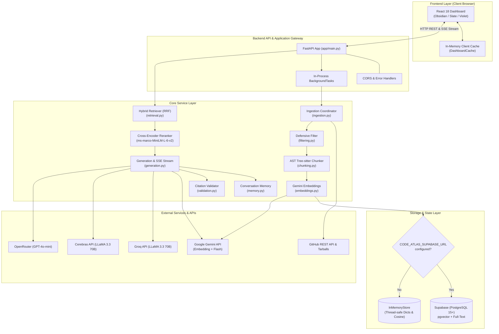
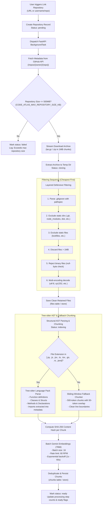
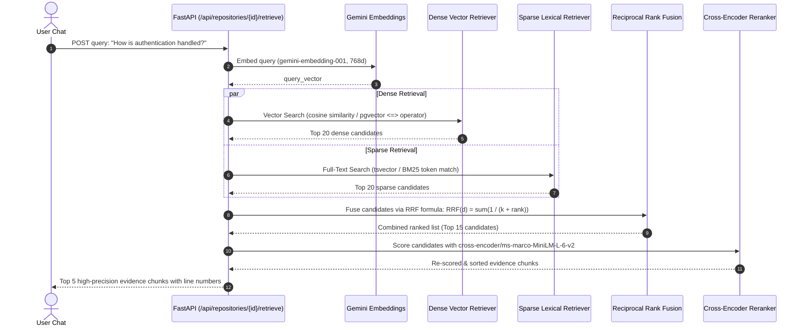
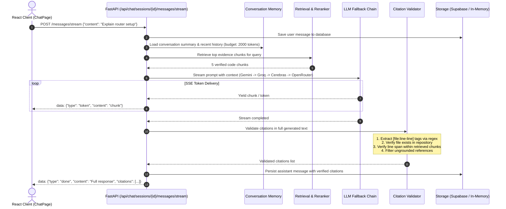
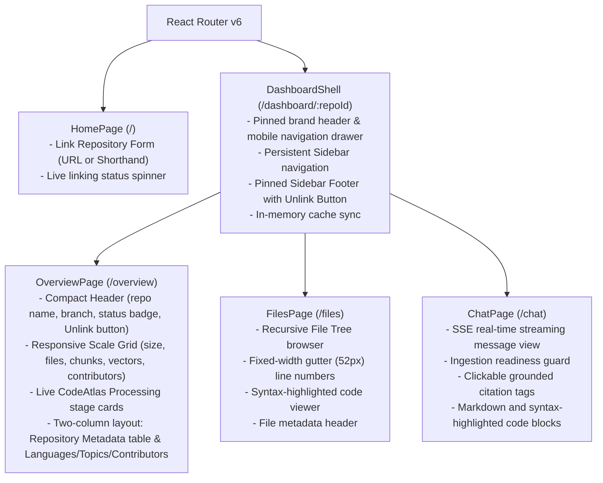
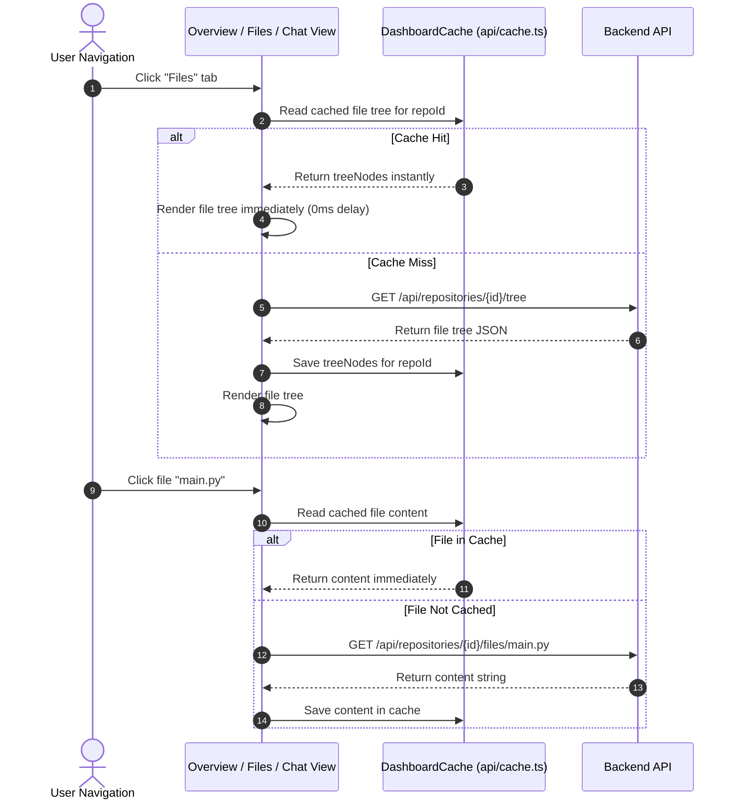
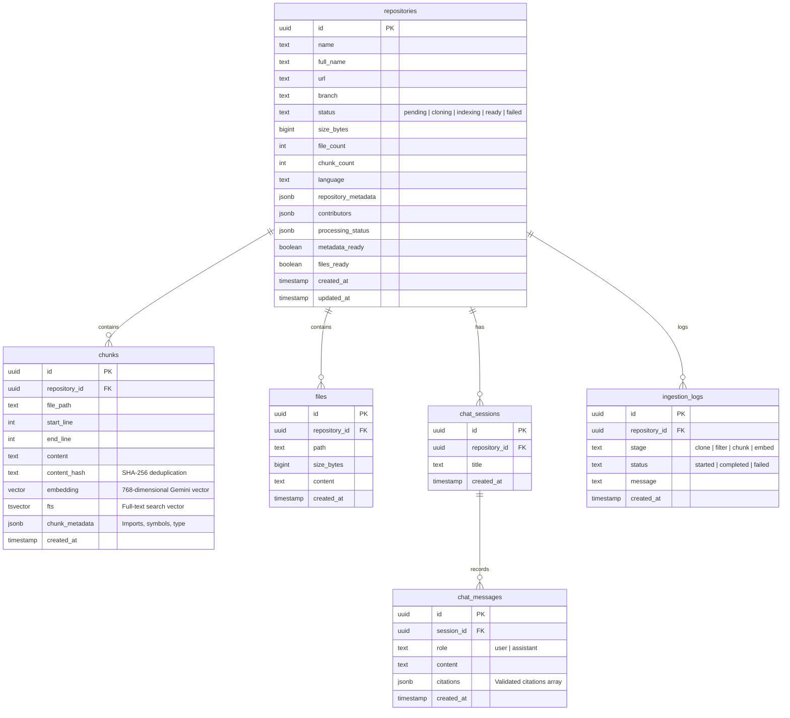

# CodeAtlas — System Architecture & Technical Pipelines

This document provides a comprehensive technical breakdown of the **CodeAtlas** architecture, detailing data flow, algorithmic design, sequence diagrams, and pipeline specifications across ingestion, hybrid retrieval, streaming generation, citation validation, and frontend caching.

---

## 1. High-Level System Architecture

CodeAtlas is decoupled into a modern **React 18 + Vite** frontend and an asynchronous **FastAPI** backend with a pluggable storage layer (PostgreSQL + `pgvector` via Supabase, or a zero-dependency thread-safe in-memory store).

---

## 2. Ingestion Pipeline

The ingestion pipeline runs asynchronously in the background so that repository registration (`POST /api/repositories`) returns immediately with status `pending`.

### 2.1 Ingestion Flowchart

### 2.2 Layered Defensive Filtering Details

| Stage | Mechanism | Rationale |
| --- | --- | --- |
| **1. Dynamic Gitignore** | `pathspec.PathSpec` on repository `.gitignore` | Prevents ingestion of developer-ignored artifacts and logs |
| **2. Static Directory Pruning** | Checks path components against `{".git", "node_modules", "vendor", "dist", "build", "coverage", "__pycache__"}` | Eliminates third-party libraries and build outputs before parsing |
| **3. Static File Filtering** | Excludes `{".gitignore", "package-lock.json", "yarn.lock", "pnpm-lock.yaml", "poetry.lock", "composer.lock"}` | Removes noise and massive configuration files |
| **4. File Size Boundary** | Skips files where `st_size > 1_048_576` bytes | Prevents memory exhaustion from large generated bundles or data dumps |
| **5. Binary Detection** | Scans for null bytes (`b"\x00"` in raw bytes) | Accurately rejects compiled binaries, images, objects, and compressed blobs |
| **6. Multi-Encoding Decoding** | Sequential attempts: `utf-8` → `utf-8-sig` → `cp1252` → `latin-1` → fallback replace | Guarantees lossless text ingestion without crashing on Windows or legacy encodings |

---

## 3. Hybrid Retrieval & Reranking Pipeline

To achieve high recall and precision, CodeAtlas combines dense vector search with sparse keyword search and cross-encoder reranking.

### 3.1 Reciprocal Rank Fusion (RRF) Formula

For each document $d$ appearing in dense ranking $R_{\text{dense}}$ and sparse ranking $R_{\text{sparse}}$:

$$RRF\_Score(d) = \sum_{m \in \{\text{dense}, \text{sparse}\}} \frac{1}{k + r_m(d)}$$

Where:
- $k = 60$ (constant smoothing parameter preventing early high ranks from dominating).
- $r_m(d)$ is the 1-based rank index of document $d$ in system $m$.
- If document $d$ does not appear in system $m$, that component contributes $0$.

### 3.2 Cross-Encoder Reranking
Top-15 candidates from RRF are passed into `cross-encoder/ms-marco-MiniLM-L-6-v2`. Unlike bi-encoders (which compute separate query and document embeddings), the cross-encoder performs joint attention over the combined token sequence:

$$\text{Input: } [\text{CLS}] \circ \text{Query} \circ [\text{SEP}] \circ \text{Code Chunk} \circ [\text{SEP}]$$

The top 5 scoring chunks are retained as evidence context for prompt construction.

---

## 4. Grounded Generation, Streaming & Citation Validation

### 4.1 Citation Validation Rules

1. **Regex Extraction**: Scans response text for markdown citation links and bracketed patterns: `[path/to/file:start-end]`.
2. **File Existence**: Verifies that `path/to/file` exists in the repository file registry.
3. **Line Range Boundary**: Checks whether `start_line` and `end_line` overlap with the line bounds of any retrieved chunk for that specific file.
4. **Ungrounded Tag Stripping**: If an LLM hallucinated a non-existent file or fabricated line numbers outside the retrieved context, the citation is removed from the metadata payload and flagged, preserving factual correctness.

---

## 5. Client Architecture & In-Memory Routing Cache

### 5.1 Dashboard Shell & Routing Topology

The dashboard is structured around an persistent layout shell:

### 5.2 Zero-Latency Navigation Cache (`api/cache.ts`)

To eliminate blank loading spinners and redundant network calls when switching between **Overview**, **Files**, and **Chat**:

---

## 6. Database Schema (Supabase / PostgreSQL)

When `CODE_ATLAS_SUPABASE_URL` is set, data is stored across 9 sequential PostgreSQL migrations:

---

## 7. Operational Modes & Failure Handling

| Failure Scenario | Mitigation Strategy | Result |
| --- | --- | --- |
| **Primary LLM provider quota exhausted / 429** | Fallback priority chain: Gemini → Groq → Cerebras → OpenRouter | Zero user-visible downtime if at least one provider has remaining quota |
| **Gemini embedding rate limit hit during ingestion** | Exponential backoff with jitter (1s base, 60s max, 5 retries) | Ingestion recovers smoothly without aborting the job |
| **Database unreachable / unconfigured** | Automatic fallback to thread-safe `InMemoryStore` | Application boots and functions locally with zero external setup |
| **Invalid or malformed repository link** | Pre-flight validation against GitHub REST API (`/repos/{owner}/{repo}`) | Clean error notification displayed on Home form before triggering background tasks |
| **Client disconnect during chat stream** | SSE stream detects socket closure and gracefully halts generator | Prevents orphan inference requests from consuming background resources |
