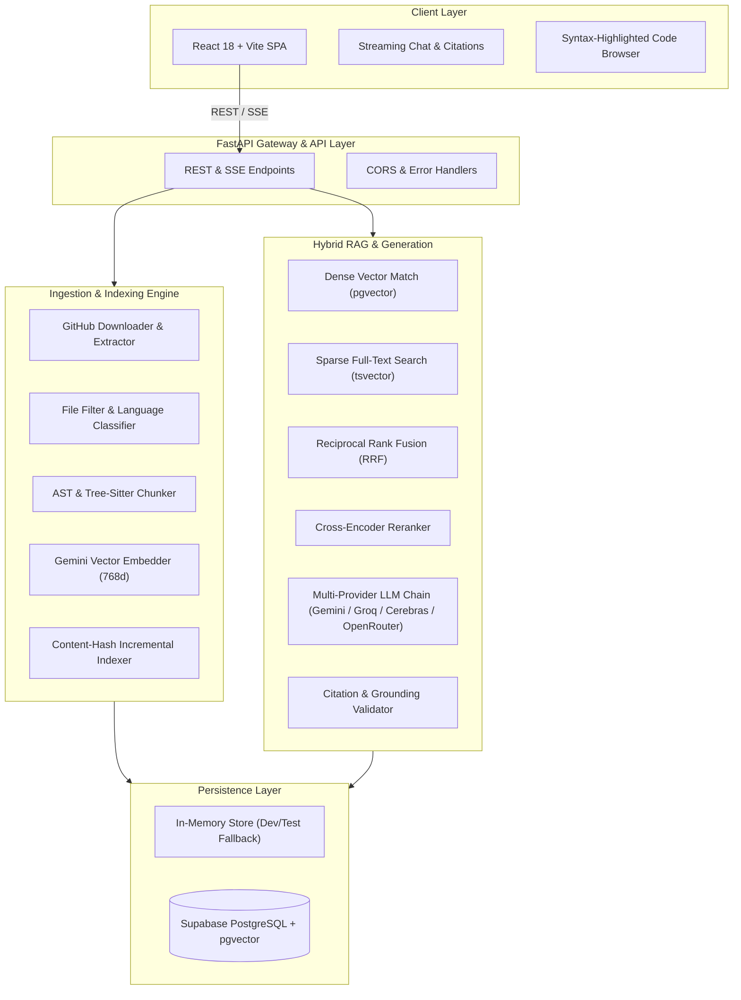

# CodeAtlas 🗺️

**CodeAtlas** is an AI-powered repository intelligence and conversational code exploration engine. It transforms complex codebases into interactive knowledge graphs, enabling developers to query, analyze, and navigate code with precision, verified source citations, and real-time streaming intelligence.

---

## 🚀 Key Highlights

- **⚡ Incremental Multi-Stage Ingestion**: Streams and extracts remote GitHub archives, filters source assets, generates AST-aware syntax chunks, and calculates content hashes for deduplicated indexing.
- **🔍 Hybrid Retrieval with RRF**: Combines dense vector search (Google Gemini embeddings) and sparse BM25/keyword full-text search merged via Reciprocal Rank Fusion (RRF), finalized by a Cross-Encoder reranker.
- **🛡️ Grounded & Validated Citations**: Validates LLM responses against retrieved evidence chunks and enforces strict line-level citations (`filepath:line_start-line_end`).
- **💬 Real-Time SSE Chat & Memory**: Streams responses with token-level Server-Sent Events (SSE) and persists conversation context using LangChain summary buffer memory.
- **🗄️ Resilient Persistence Strategy**: Dual-mode storage supporting enterprise Supabase PostgreSQL + `pgvector` with zero-config in-memory fallback for local development and CI testing.

---

## 🏗️ Architecture Overview



---

## 📂 Project Structure

```
codeatlas/
├── docs/                      # Technical documentation suite
│   ├── API.md                 # Comprehensive REST & SSE API specification
│   ├── ARCHITECTURE.md        # Deep-dive architecture and component design
│   └── CONFIGURATION.md       # Complete environment variable reference
├── README.md                  # Project overview and quickstart guide
│
├── backend/                   # FastAPI Python backend service
│   ├── app/
│   │   ├── config.py          # Pydantic Settings & environment parsing
│   │   ├── main.py            # Route handlers & lifecycle events
│   │   ├── models.py          # Domain models & Pydantic schemas
│   │   ├── persistence.py     # Supabase REST client implementation
│   │   ├── store.py           # Unified In-Memory / Supabase store boundary
│   │   └── services/          # Core business services
│   │       ├── chunking.py    # Language-aware file chunking
│   │       ├── embeddings.py  # Gemini embedding integration & batching
│   │       ├── evaluation.py  # Automated golden evaluation framework
│   │       ├── filtering.py   # File exclusion & extension classification
│   │       ├── generation.py  # Provider chain, validation, and SSE streaming
│   │       ├── github.py      # GitHub archive downloader & metadata inspector
│   │       ├── indexing.py    # Incremental document indexer & hash records
│   │       ├── memory.py      # LangChain conversation buffer memory
│   │       ├── reranking.py   # Cross-encoder semantic reranker
│   │       ├── retrieval.py   # Hybrid dense/sparse search & RRF merger
│   │       └── validation.py  # Citation grounding & verification logic
│   ├── tests/                 # Unit, integration, and recovery test suite
│   └── pyproject.toml         # Python package dependencies & tools
│
├── frontend/                  # React 18 TypeScript frontend
│   ├── src/
│   │   ├── api/               # API clients, SSE stream consumers, and cache
│   │   ├── components/        # UI components & dashboard shell
│   │   ├── hooks/             # Custom React hooks (useChatSession)
│   │   ├── pages/             # Route pages (Home, Overview, Chat, Files)
│   │   └── utils/             # Citation formatting & markdown helpers
│   ├── package.json           # Frontend dependencies and build scripts
│   └── vite.config.ts         # Vite build configuration
│
└── supabase/                  # Database schema migrations
    └── migrations/
        ├── 0001_initial_schema.sql
        ├── 0002_retrieval_schema.sql
        ├── 0003_evaluation_schema.sql
        └── 0004_fix_semantic_cache_similarity.sql
```

---

## ⚡ Quickstart Guide

### Prerequisites
- **Python 3.12+**
- **Node.js 18+** & **npm**
- **Google Gemini API Key** (Required for embeddings and default generation)
- *(Optional)* **Supabase Project** (For durable database persistence)

---

### 1. Backend Setup

```bash
# Navigate to backend directory
cd backend

# Create and activate virtual environment
python -m venv .venv
# On Windows:
.venv\Scripts\activate
# On Linux/macOS:
# source .venv/bin/activate

# Install dependencies in editable mode with test tools
pip install -e ".[test]"

# Configure environment variables
# Copy template or create .env file:
# CODE_ATLAS_GEMINI_API_KEY="your-gemini-api-key"
```

Start the backend development server:
```bash
uvicorn app.main:app --reload --port 8000
```
API Documentation will be accessible at: `http://localhost:8000/docs`.

---

### 2. Frontend Setup

```bash
# Navigate to frontend directory
cd ../frontend

# Install dependencies
npm install

# Start Vite development server
npm run dev
```
Access the application web interface at: `http://localhost:5173`.

---

## 🧪 Running the Test Suite

Run the complete backend automated test suite:
```bash
# Run all unit and mock-backed integration tests
pytest

# Run tests with short execution summaries
pytest -q -m "not live"

# Run specific domain test suites
pytest tests/test_retrieval_pipeline.py tests/test_semantic_cache.py
```

Run frontend typecheck and production build:
```bash
cd frontend
npm run build
```

---

## 📖 Documentation Index

- 📘 [**ARCHITECTURE.md**](./docs/ARCHITECTURE.md): System architecture, pipeline flows, and component interactions.
- 📙 [**API.md**](./docs/API.md): Full REST & Server-Sent Events (SSE) API specification with JSON schemas.
- 📗 [**CONFIGURATION.md**](./docs/CONFIGURATION.md): Complete reference for environment variables and runtime settings.

---

## 📄 License

This project is licensed under the MIT License.
