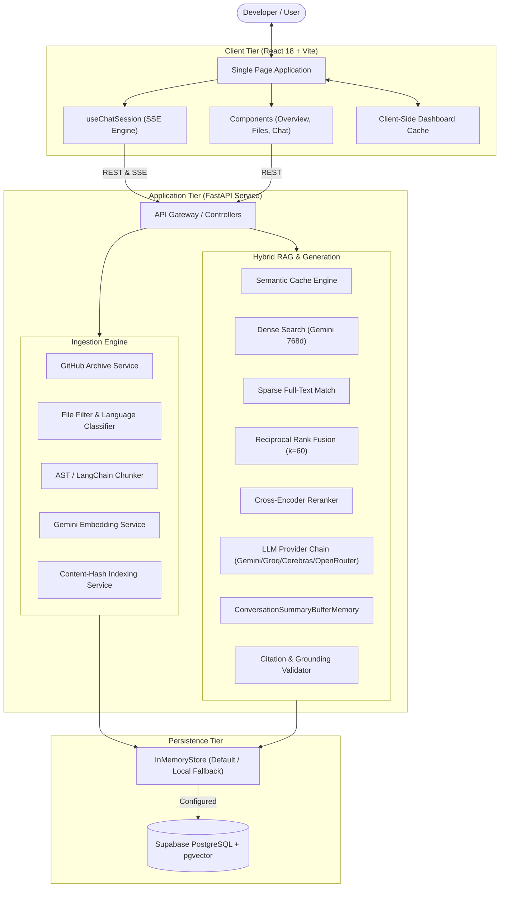
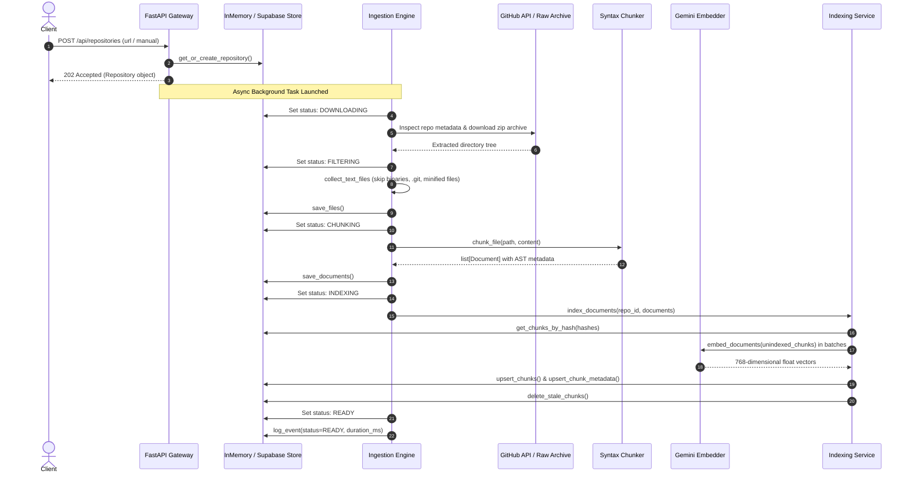
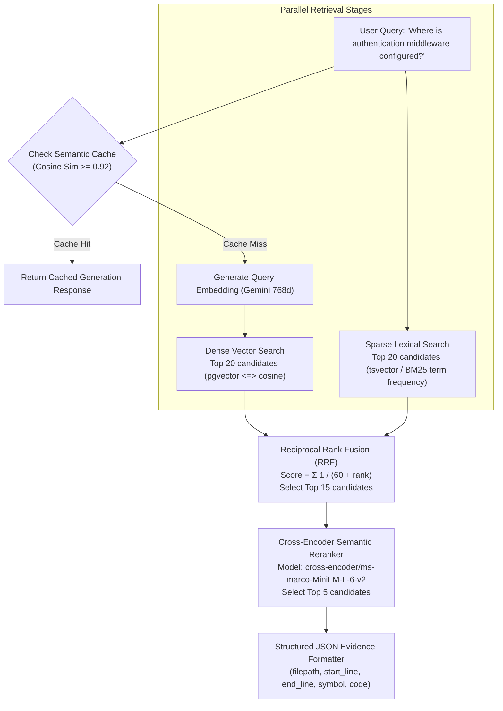
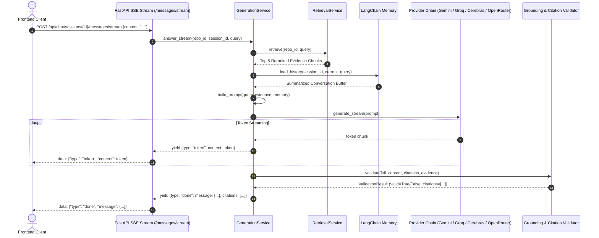
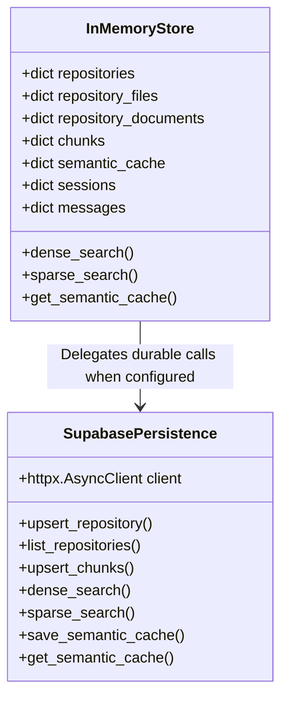

# CodeAtlas Architecture Guide 🏛️

This document outlines the architectural blueprint, data flows, core components, and engineering decisions behind **CodeAtlas**.

---

## 1. System Context & High-Level Architecture

CodeAtlas operates as a decoupled client-server system designed for repository intelligence, code semantic search, and citation-grounded conversational reasoning.



---

## 2. Ingestion & Indexing Pipeline

The ingestion pipeline transforms raw repository source code into indexed, searchable chunks. It is designed to be **incremental**, **idempotent**, and **resilient** to network interruptions.



### Ingestion Lifecycle Stages
```
QUEUED ──► DOWNLOADING ──► FILTERING ──► CHUNKING ──► INDEXING ──► READY
  │                                                                 ▲
  └───────────────────────────────► FAILED ─────────────────────────┘ (Retry on duplicate submission)
```

1. **`QUEUED`**: Repository registered in database; waiting for worker execution.
2. **`DOWNLOADING`**: Fetching repository metadata (stars, forks, languages, topics) and streaming ZIP archive from GitHub.
3. **`FILTERING`**: Filtering out binary assets, images, vendor dependencies, and lockfiles, while persisting valid text files.
4. **`CHUNKING`**: Language-specific AST/Tree-Sitter semantic chunking to preserve symbol contexts (class/function definitions, line numbers).
5. **`INDEXING`**: Computing SHA-256 content hashes, deduplicating against existing vectors, generating Gemini embeddings, and persisting to Postgres `pgvector`.
6. **`READY`**: Repository fully indexed and available for hybrid search and chat queries.
7. **`FAILED`**: Ingestion encountered an unrecoverable error; error message captured and logged.

---

## 3. Hybrid Retrieval & Reranking Architecture (RAG)

CodeAtlas uses a state-of-the-art hybrid search pipeline combining **Dense Semantic Search**, **Sparse Lexical Search**, **Reciprocal Rank Fusion (RRF)**, and **Cross-Encoder Reranking**.



### Reciprocal Rank Fusion (RRF) Formula
Candidates from dense and sparse retrieval stages are merged using the constant $k = 60$:

$$\text{RRF\_Score}(d) = \sum_{m \in \{\text{dense}, \text{sparse}\}} \frac{1}{60 + \text{rank}_m(d)}$$

---

## 4. Generation Pipeline & Streaming Protocol



### Multi-Provider Fallback Strategy
If a provider encounters an HTTP error, quota exhaustion, or rate limit, `ProviderChain` automatically fails over in sequence:

```
1. Google Gemini 2.5 Flash (Primary)
   └──► 2. Groq LLaMA 3.3 70B (Fast Fallback)
        └──► 3. Cerebras LLaMA 3.3 70B (High-Throughput Fallback)
             └──► 4. OpenRouter GPT-4o-mini (Universal Fallback)
```

---

## 5. Persistence Architecture

CodeAtlas uses a dual-engine storage architecture:



### Database Entities & Schema Mapping
- **`repos`**: Repository metadata, statistics, ingestion stage, branch, and configuration.
- **`repository_files`**: Source file contents indexed by `(repo_id, path)`.
- **`chunks`**: Content chunks with `vector(768)` embeddings and content hashes.
- **`chunk_metadata`**: Symbol names, types, line ranges (`start_line`, `end_line`), and import statements.
- **`chat_sessions`**: Conversation session records linked to repositories.
- **`chat_messages`**: User and assistant messages, including verified citation metadata.
- **`semantic_cache`**: Query embeddings and generation responses with similarity thresholding.
- **`logs`**: Structured audit events with sensitive token redaction and execution latencies.

---

## 6. Security, Redaction, & Error Boundaries

- **Sensitive Data Redaction**: The [`logging_utils`](file:///d:/workspace/codeatlas/backend/app/logging_utils.py) subsystem automatically strips API keys, Authorization headers, Bearer tokens, and secrets from all logs and database event payloads.
- **Global Error Boundary**: FastAPI global exception handlers catch unexpected runtime failures and return sanitized RFC 7807 compliant error payloads without exposing internal stack traces.
- **Citation Guardrails**: Hallucinated file paths or invented line numbers are stripped by `CitationValidator` before citations are presented in the UI.
